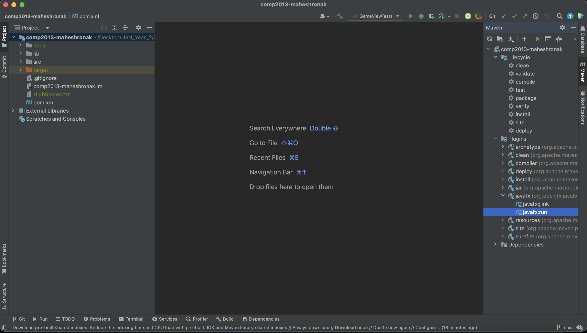

# Snakee Game 
## Created by Ronak Mahesh

## Project Description

This project implements a condensed and slightly modified version of the beloved classic arcade game, Snake. The game was developed in Java and is a modified version of existing, incomplete legacy code. 

## Installing & Running The Game

To run the game:-
1) Please download a zipped version of the source code from this repository onto your machine. 
2) Unzip the folder and extract the files. 

From here, you have two options:-

### 3a) Run the game via the command line
- To do this, make sure you have Maven 17+ installed on your local machine.
- Navigate to the "comp2013-maheshronak-main" directory via the command line.
- Run the command "**mvn clean javafx:run**" in the base directory

### 3b) Run the game via IntelliJ
- If you wish to run the game in an IDE, please ensure that you have IntelliJ IDEA Community/Ultimate installed. If prompted, please install JDK 19.
- You can now run the game using two different methods:-

- 1- Open the file src/main/java/com/view/SplashScreen.java in IntelliJ
  - Right click on the file or anywhere on the screen when it's open, and select "Run SplashScreen.java"
  

- 2- Open the Maven menu from the right side of the screen (load maven if prompted), and go to Plugins -> javafx -> javafx:run.

4) After doing either of these- enter your name, select a theme, and configure your sound options (loops by default). Then hit "Start Game!" and enjoy! 

## How To Play The Game:-

The objective is simple- survive for as long as you can and eat as many fruits as possible. Use your arrow keys or WASD (or a combination of both) to move the snake. If you hit a wall, part of yourself, or go out of bounds, then it's game over :(

Feel free to browse the leaderboard from the main menu once you finish your first playthrough!

## Credits

- Original Maker- Sigurður Sigurðardóttir
- Fade Transition- https://genuinecoder.com/javafx-splash-screen-loading-screen/
